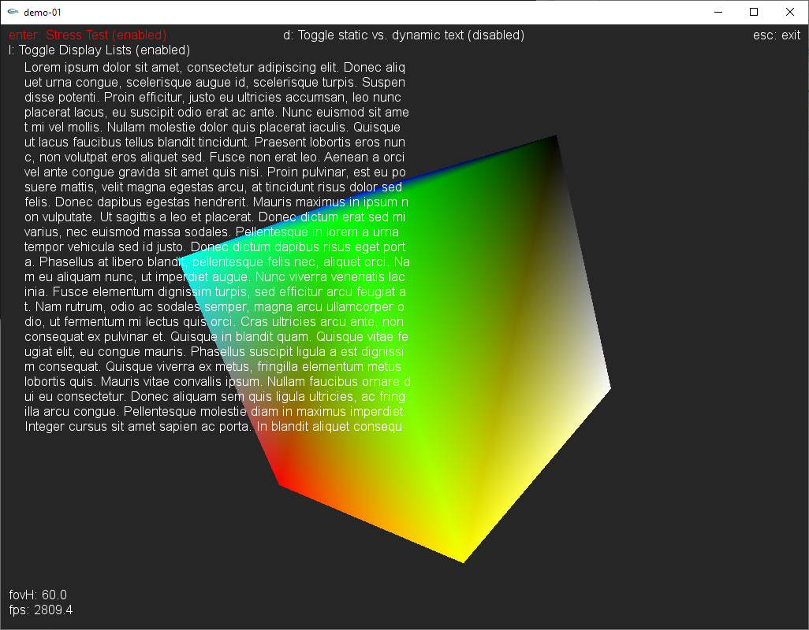
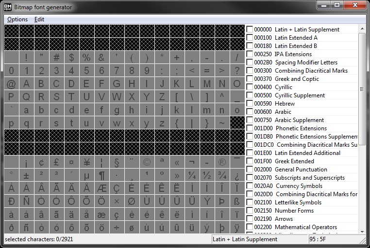
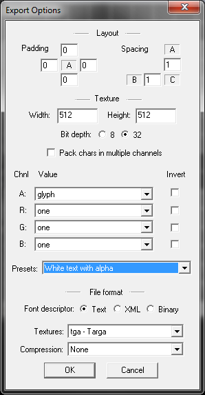

# GLFontLibrary

This font rendering library was designed with ease of use and render performance in mind. I've written it in ~2012 and updated it every now and then. The font files read by this library follow the format developed for the BM Font Generator: http://angelcode.com/products/bmfont/. The font file is accompanied by a texture file. The library supports standard textures, as well as single channel and even multi channel SDFs.

# Changelog
- April 22nd 2020: added support for XML format .fnt files, added multi SDF support
- April 14th 2020: moved project from MFC to standard libs
- April 6th 2020: added SDF fonts from the famous Valve Paper: https://steamcdn-a.akamaihd.net/apps/valve/2007/SIGGRAPH2007_AlphaTestedMagnification.pdf, the font lib now supports the smoothing function as described in the paper, I have not implemented the outline,glow and dropshadow yet. This allows for very nice scaling of the SDF font, whereas scaling with the conventional method will result in pixelated and blurry text.
.")

- March 30th 2020: added a demo app, to be compiled using Visual Studio 2012 or later. The app teaches and benchmarks the use of the Font Library and shows how every single exposed function is intented to be used.



# Plans
- I'd like to replace the direct mode GL calls with modern GL and an appropriate shader.
- I'm also considering to implement glow, dropshadow and outline for the SDF fonts (as well as multi SDF interpolation).
- Lastly, I'm planning on porting this to Vulkan.

Stay tuned.

# Overview
The font library is divided into the following files:
 - FontLibrary.cpp/.h - main lib with rendering functionality
 - FontFileParser.cpp/.h - helper files for reading fonts from file
 - Font.cpp/.h - helper files
 - Texture.cpp/.h - helper files for loading a texture into GL memory
 - acutil_unicode.cpp/.h - AngelCode Tool Box Library, just used for UTF16 encoding, nothing else.. could be cut if not wanted
 - SDF_Font.frag/.vert - shader files for enabling use of SDL fonts
 
# Working Principle
The DrawString function call does the following: receives string → parses string → creates list of quads → draws list of quads. All this is done in the fixed function pipeline of OpenGL. Thanks to "draw lists" this is of similar performance as the OpenGL 2.0+ way of rendering (benchmarked).

During the parsing, the string to draw is checked for characters that are not drawable by the current font, those chars will be drawn as question marks.
For each character in the string, a quad is created and added to the final quad-list, this quad contains information about the position and size on the screen(2D, orthogonal!) and the texture coordinate for that one character within the bitmap font. The position of a quad depends on the starting position of the string and the position of the previous character. The specific relation between the spacing of one character and the next is called kerning. The font config file contains a table with all kerning information for that specific font. E.g. it could be, that if an “a” follows a “M” it needs to be one pixel apart, however when an “o” follows an “M” it is minus one pixel, or zero pixels. These information are stored internally in a two dimensional array for fast access. 
The complete list of quads is then given to the actual renderer, this render is openGL specific, however since we have all information in a generic list of quads, this render function may be changed to use directX very easily.
To make this drawing fast enough, all information about the characters and character-relations(like kerning), as well as the textures are loaded on program start.

# Adding Font Library to your Software
This chapter is concerned with the integration of the font library into your own software.
 
## Integrating font library
You will need to copy the 10 files mentioned in the Overiew into your project folder.

In your code, create a global font library object, before opening a rendering context, like so:
```C++
//load openGL fonts
m_fontLibrary = new CFontLibrary(<PathToFontFolder>);
if(!m_fontLibrary->ParseAllFontsInFolder())
    return; //no fonts found!
```
This will load all fonts that are stored in the folder you've specified as input parameter. After the rendering context is created, the textures need to get loaded, like so:
  
```C++
//init font library from the current rendering context!
theApp.m_fontLibrary->InitGLFonts();
```

This can be done in a one time Init function of that render context for example. Keep in mind that you can't share textures between two or more contexts with this library (I didn’t implement it because at the time there was no efficient way of doing it, only some Nvidia cards could and only sort of). So you have to call this for each new rendering context.
Once this is done, the font library is ready to use, which means you can call the DrawString() method from the FontLibrary object.

## Using the DrawString call
The header of the draw call reads:

```C++
void DrawString(CString textToDraw, int x, int y, float color[4], int contextID, CString font, bool sdf, float scale = 1.0f);
```
The parameters are described below in the table.

| Parameter        | Description |
| ------------- |:-------------:|
| CString textToDraw     | The string to draw as CString, not recognized characters are drawn as '?'. Which characters are valid depends on the font used and can be defined when creating the font-bitmap, more here: 3. |
| int x      | X-Position of the beginning of the string in screen coordinates.     |
| int y | Y-Position of the beginning of the string in screen coordinates.     |
| float color[4] | float array containing the color information that will be used to modulate the texture. Color information are values from 0.0 to 1.0(inclusive), in the following standard order: {R, G, B, Alpha} obviously.. |
|CString font | This parameter defines the font type to use. Only font types can be used that are in the Folder and were there at loading time. You may pass in the file name of that font, without the extension or for more code readability and safety use the define from file: FontLibrary.h. Note: if you want to print bold or italic, then you have to use a font that is setup to do that, read more about this top in chapter 3. |
| bool sdf    | As the name suggests, denoted the use of the SDF shader. If sdf == true, sdf shader will be used, if false then conventional GL rendering technique without sdf will be used. Note that if the SDF texture was made for use of a SDF shader and sdf == false then the text will appear blurry. The other way around will work just fine.
| float scale | It is highly recommended to use the default: 1.0f. If you want to scale the font, you may also use glScalef.. but again, it is not recommended! Instead create font files that have the correct pixel height, e.g. If you want to use Arial with 24pixel height, use Arial24 and NOT Arial12 with scale 2.0 or equally worse: Arial48 with scale 0.5. However, sometimes it is inevitable to use a scale function. For future development it may be useful to choose the correct font according to the scale parameter instead of just scaling the quads for the existing font, but it is not implemented as of writing this document. |

Note that there are more functions with additional features, such as automatic line breaks. See font library header file.


# Adding new Fonts
This chapter is concerned with adding your own fonts to the font library.

Note that I focus on non-SDF fonts here. The steps for SDF fonts are quite similar, however Bm-Font-Gen does not suffice. You can still use that tool, but you will need to perform a post processing step with tools like this ImageMagick. Tutorial below.

Only three steps are necessary to integrate a new font:
    1. Create the font-config and font-bitmap using BM-Font-Generator
    2. Copy the two resulting files into your fonts folder
    3. (optional) add the font string as define to FontLibrary.h so you can use it more easily in your app
  
In the following section, the use of BM-Font Generator is described in detail, but first a few notes. Each font-file you produce contains only a font of a fixed size, also it is already defined by the file whether it is bold or italic, etc. Same counts for outline, smoothness of the font, etc. This matter will become more clear with the following section.

## Using Bm-Font-Generator
For producing the font-config as well as the actual font bitmap, I use the “Bitmap Font Generator” from AngelCode. Which can be obtained from their website: http://angelcode.com/products/bmfont/
After installation, open the program, it should look like in the following figure.



### Font Settings Menu
As a first step, open the Font-Settings, by clicking on Options → Font Settings or by hitting [F], which will open a new window, as shown by the next figure.


1. select the font type(or “face”). If the font type is not in the list, you need to install it on your windows system by adding the true type font file for it to the system font folder, all fonts in that folder will be accessible by the BM-font generator.
2. Charset: for most cases “Unicode” should do.
3. Not sure what the tick “Output invalid char glyphs” does, so leave it free
4. Select the size of the font, which will for most fonts be equal to their line height in pixels, however, some fonts dont follow these size values, like “Calibri”. The tick “Match char height” is unclear to me, I leave it free.
5. Leave Height at 100%
6. If you like, select bold or Italic, but keep in mind, if these are selected, it can not be changed once the bitmap is created.
7. Font Smoothing should definitely be selected!
8. Super sampling - don't, unless you want blurry images, the application for this is fairly rare.
9. Under effects there is “Outline thickness” usually this should be zero, however in some cases we want to show the outlines of a font, e.g. white text with black outline. We created such a font for the caption of the video tags for Singapore, because it yields a high readability on changing backgrounds like a video.
    
After you made these setups, close the Font Settings window and proceed to the next step.

### Character Selection
Back in the main window of the program, you can now select the character sets you'd like to include. You can either select full sets or select only specific characters of a set. As an example see next figure.


As a basic rule, only select the characters that you are likely to use, this saves processing time and most of all memory, not just one character, but a lot more(kerning, bitmap size, array sizes in our code, etc.).
After you selected all characters your font shall include, proceed to the next section.

### Export Options

It is now time to export the font as a bitmap and a create a config file for it.
Open the Export Options my hitting either [T], or clicking Options → Export Options. A new window should pop up, looking like in the following figure.



1. Leave Padding and Spacing at default.
2. Set the width of the texture to something big enough to hold all your selected characters, but also not too large, you don't want to waste space in the bitmap for emptyness. How you determine whether the texture has the right size or not will be discussed in the next subsection.
3. Bit depth needs to be set to 32, otherwise the library can't load the tga file!
4. Leave the Checkbox “Pack chars in multiple channels” empty
5. rather than defining the channels yourself, select the preset “White text with alpha”, this should be the usual setting. Otherwise, if you would like a font with outline, then set it to: “Outlined text with alpha”.
6. Font descriptor must be set to “Text” only!
7. Texture format should be “tga – Targa”
8. and compression: “none”
    
Once these settings are done, close the window and proceed to the next step.
  
### Determining correct texture size
To make sure that your texture is neither too large or too small, hit [V] while in the main window or click Options → Visualize.
If the window title says anything but “Preview 1/1” your texture is too small for all your characters and the program would produce more than one bitmap. In that case, open the Export Options and increase your texture size. Note: it doesn't need to be squared or a power of two anymore, this was only in OpenGL Version 1, the case. However, I would still recommend it to make it as such, since some texture related functions may be still optimized for it.
The FontLibrary intentionally doesn't handle more than one “page” or texture, as this would mean to bind/unbind the texture during one DrawString call, which is slow! So make it exactly one page.
If on the other hand you see that the characters only fill a portion of the bitmap, reduce the texture size, if possible, but this isnt as important as the other way around.
Once you are satisfied with the texture space usage, proceed to the next step.

### Exporting the Font
Now that all settings are made, its time to export the font. Click on Options → Save Bitmap-Font as.. .
The filename you specify here will affect the name for the font in the font library, so choose it wisely. For convenience and readability reasons, I suggest the following naming convention: <br>
<fontFaceName><_italic?_><_bold_><_outlined?size?><size> <br>
here are a few examples: <br>
- Arial8
- Arial20
- Arial_italic_12
- Arial_bold_italic_23
- Arial_outline2_10
- Helvetica_italic_outline1_12
etc.

Hit Save to complete the process. All there is to do now, is to copy the two files for that font into the fonts folder of your software.

### Converting Texture to Signed Distance Field Texture
3 step process:
 
#### BMFont:
- font size: 400px
- bitmap size: 8192x4096
- smoothing enabled
- no outline or other special features
- Padding: 45px on all sides
- still white text with alpha
- bit depth still 32
- texture format either tga or png (since imageMagick can convert it to tga later if needed)

#### Edit Font File:
- add the following the header before the chars:
fieldType=sdf

#### ImageMagick:
 from command line, run:
 
magick convert --% Arial400_0.tga -filter Jinc ( +clone -negate -morphology Distance Euclidean -level 50%,-50% ) -morphology Distance Euclidean -compose Plus -composite -level 45%,55% -resize 25% Arial400_0.tga

#### Multi-Channel SDFs
WORK IN PROGRESS
use: https://soimy.github.io/msdf-bmfont-xml/
You need to start from a ttf file, but you will receive the usual fnt plus a png file. 
run: msdf-bmfont -o multisdf.png cour.ttf

## Defining Fonts in the Font-Library
This is optional: Make a define for each new font you add to the FontLibrary.h, this should make debugging and coding easier!

```C++
//font type defines, string must match the filename without extension in your fonts folder!
#define GLFONT_ARIAL_OUTLINE2_64 "Arial_outline2_64"
#define GLFONT_ARIAL20 "Arial20"
#define GLFONT_ARIAL24 "Arial24"
#define GLFONT_ARIAL32 "Arial32"
#define GLFONT_CALIBRI_24 "Calibri24"
#define GLFONT_CAMBRIA_24 "Cambria24"
#define GLFONT_COURIER_8 "Courier8"
#define GLFONT_TAHOMA_32 "Tahoma32"
#define GLFONT_TIMES_NEW_ROMAN_ITALIC_24 "TimesNewRoman_italic_24"
#define GLFONT_TIMES_NEW_ROMAN_24 "TimesNewRoman24"
```
.. add your own defines here!

